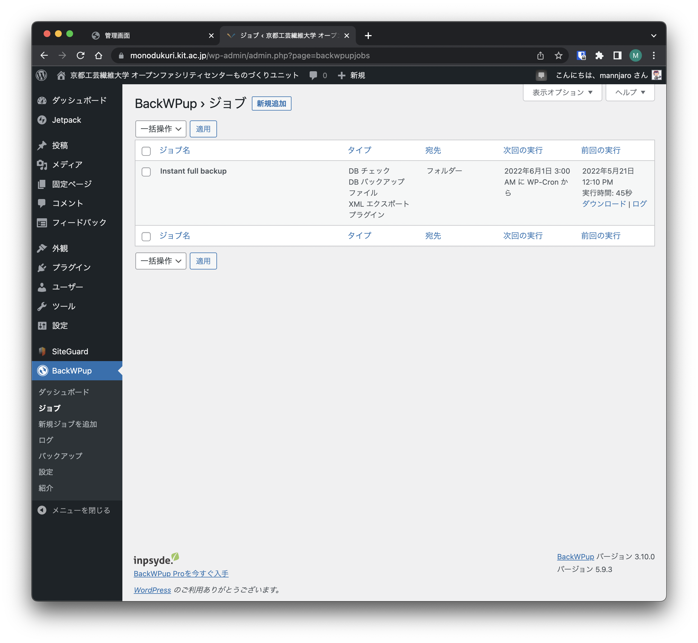

# WordPressの使い方

## 管理画面ログイン

ホームページのURL末尾に`/login_factory`を追加してください

からログインできる  
~なぜか，この画面のアクセスだけ異常に重い...~

## できること

固定ページの編集やユーザーの追加，ワードプレスのバージョンアップなどを行う．  
たまにアクセスして，Wordpressのバージョンアップを行う程度

### バックアップの作成

1. サイドバーのBackWPupから"ジョブ"を選択
2. Instant full backupにカーソルを合わせ，下の今すぐ実行を選択
3. 実行されるので，完了するまでページを離れずに待つ

?> NOTE: ダウンロードをクリックしても，正常にダウンロードできないので注意

### 編集用ユーザーの追加方法

1. サイドバーのユーザーから新規作成
2. 権限グループを編集者に設定し，生成されたパスワードをアカウントを伝える

