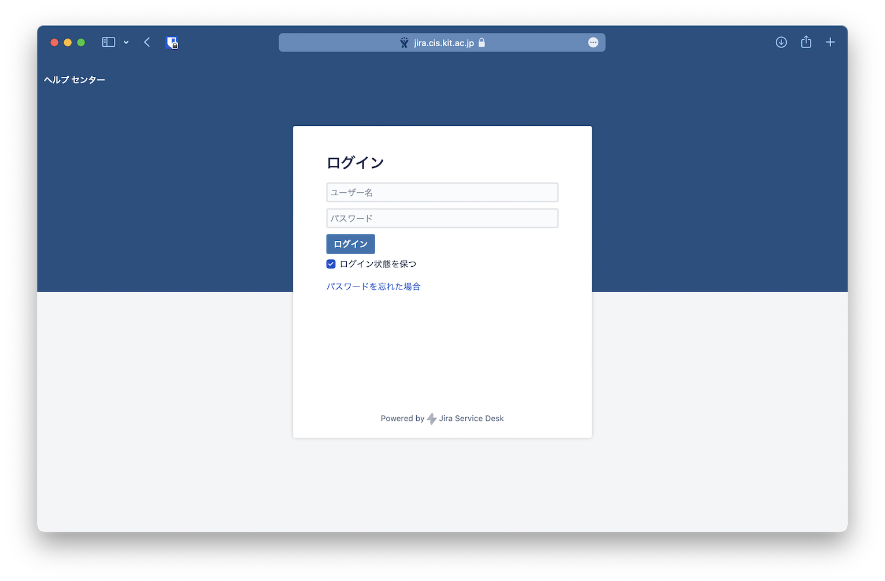
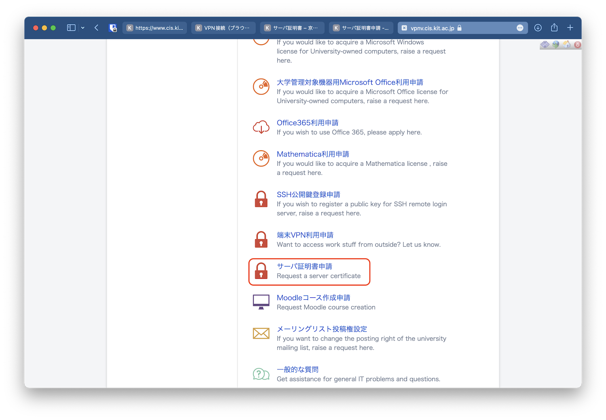
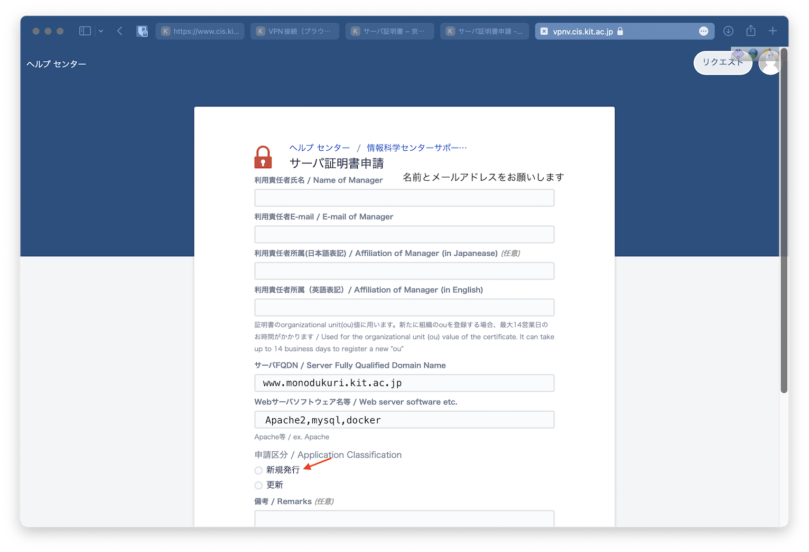

# サーバー証明書発行手順

!> 教職員アカウントのみ申請できます

1. [情報科学センターサポート窓口](https://helpdesk.cis.kit.ac.jp) にアクセスし，CISのアカウントでログインする

2. 申請項目の一覧からサーバー証明書申請を選ぶ

3. 必要事項を記入し，新規作成を行う

必要事項

- 利用責任者氏名
- 利用責任者E-mail
- 利用責任者所属（日本語表記）
- 利用責任者所属（英語表記）
- サーバーFQDN（ホームページのURLからhttp://を省いたもの）  
www.monodukuri.kit.ac.jp
- Webサーバーソフトウェア名等（ミドルウェアと解釈してます）  
  - `Apache2, mysql, docker`
- 申請区分  
初回のみ新規発行で，証明書の有効期限が切れた場合は更新にチェックを入れてください

