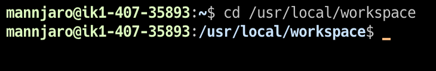

# 基本的なコマンド

ターミナルをある程度触ったことがある人は読まなくても大丈夫です

## ファイル操作

ターミナル上ではWindowsのエクスプローラーやMacのFinderのようにGUIでファイルを選択したりフォルダを移動したりできません．その代わり，ターミナルにコマンドを打つことで同等の操作が可能になっています．

?> **_NOTE:_**  ターミナルとはよく言われる黒い画面のこと．ターミナルエミュレータやコンソールと呼ばれるが，今回はターミナルで統一する

フォルダの移動を理解するためには，Linuxのディレクトリ構成の概念について理解する必要があります．全て解説するのは無理なので，以下のサイトなどを参照してみてください．

- [【Linuxの基礎知識】ディレクトリ操作について！](https://www.pmi-sfbac.org/linux-directory/)
- [Linuxのディレクトリ構成（構造）とは？ Windowsフォルダとの違いを覚える！](https://kitsune.blog/linux-directory)
- [Linuxディレクトリ構造 - Qiita](https://qiita.com/nys9302/items/a8ddeedd3cd9d0deb332)

?> **_NOTE:_**  ファイルは.txtや.pdfのようなデータを指す．ディレクトリは，ドキュメントやダウンロードなどその中にファイルを含むまとまりを指す．

### フォルダの移動

フォルダ間を移動するには`cd`というコマンドを利用します．(change directoryの略)  
使い方としては`cd {移動したいフォルダのパス}`(cdとパスの間は半角スペースがあります)というように，コマンドとその引数というような使い方をします．  
試しにwordpressのフォルダが置いてある場所まで移動してみましょう．

```bash
cd /usr/local/share/workspace
```



フォルダを移動すると，ユーザー名の横に現在選択しているフォルダが表示されます．

?> **_NOTE:_** ログインした時の`~`はホームディレクトリを表しており，/home/{ユーザー名}/と同等の意味を持つ

### ファイル，フォルダ一覧の表示

フォルダの移動に成功しましたが，エクスプローラーのようにどんなファイルやフォルダがあるのかがまだ分かりません．  
これを確認するには`ls`というコマンドを利用します．(list segmentの略)
```bash
ls
```
すると次のように表示されます．


下に表示されたのが，/usr/local/workspaceの中にあるファイルです．
このうち，青色の太字で表示されているのがディレクトリで，白い文字で表示されているのがファイルです．

では一旦，最初のフォルダまで戻ってみましょう

```bash
cd
```
ホームディレクトリに戻る時は`cd`と打つだけで移動できます．


### ファイル，フォルダの作成

一旦ホームディレクトリに戻ってきたので，次はファイルとフォルダの作成をしてみましょう．

ファイルを作成するには，`vi`,`vim`,`touch`などいろんなコマンドが用意されていますが，今回は`touch`を使います．

```bash
touch test_file.txt
```

ここで，`ls`コマンドを打つと先ほど作成した`test_file.txt`が見えるはずです．

今度は，ディレクトリも作成してみましょう．
ディレクトリを作成する時は`mkdir`コマンドを用います

```bash
mkdir test_dir
```

同様に`ls`で`test_dir`が造られたことが確認できます．

### 削除

次に，今作成したものを削除してみましょう．
ファイルの削除には`rm`コマンド，ディレクトリの削除には`rmdir`コマンドを用います．(remove，remove directoryの略)

```bash
rm test_file.txt
rmdir test_dir
```

!> ディレクトリ内にファイルが一つ以上ある場合，rmdirコマンドは失敗します．

!> 強制的に削除したい場合は `rm -rf {ディレクトリ名}`(-rfはrecursive forceの意味)で削除できますがディレクトリ内のデータを全て削除するため，使用には細心の注意を払ってください

## 作業を終了する

サーバー上で行う作業を終了する場合は，`exit`コマンドを用います．
```bash
exit
```
サーバーとの接続は終了しますが，サーバーは動いたままですので安心してください．

